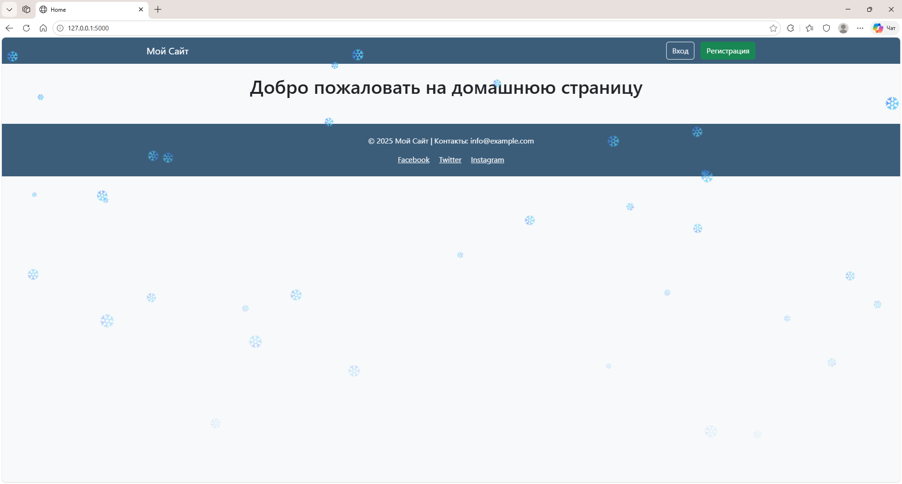
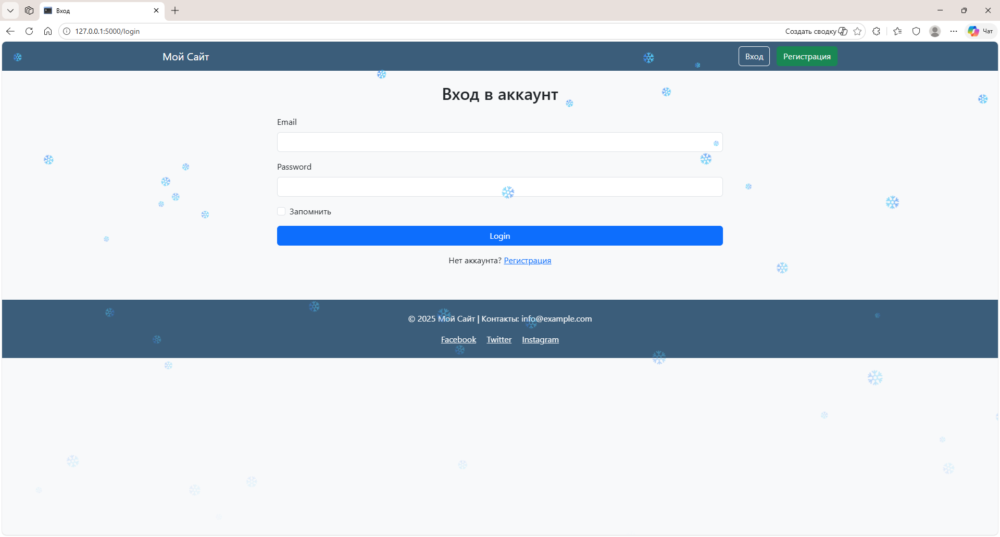
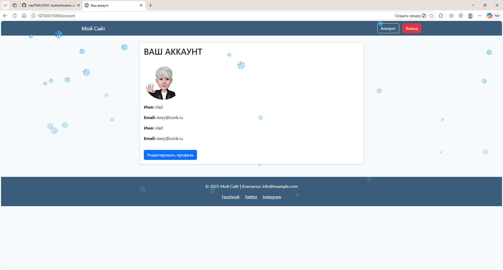

---

# 🌟 Flask Auth App  
### Authentication, Authorization & Profile Editing with Avatar Upload

<p align="center">
  
</p>

<p align="center">
  <a href="READMEru.md">🇷🇺 Русская версия</a> • 
  <a href="READMEen.md">🇬🇧 English version</a>
</p>

<p align="center">
  
  
  
  
  
</p>

<p align="center">
  <a href="https://hub.docker.com/r/vladtma/flask-auth-app">
    
  </a>
</p>

---

## ✨ Overview

A clean and modern Flask application featuring:

- 🔐 User registration & login  
- 👤 Profile editing  
- 🖼 Avatar upload  
- ❄️ Snow animation (JS + CSS)  
- 🎨 Smooth UI effects  
- 📱 Responsive Bootstrap layout  
- 💾 SQLite + SQLAlchemy  
- 🔑 Password hashing (Flask‑Bcrypt)

Полные версии документации доступны по ссылкам выше.

---

## 🎨 Screenshots

| Home | Registration |
|------|--------------|
|  |  |

| Login | Account |
|-------|---------|
|  |  |

---

## 🚀 Quick Start (Local)

```bash
pip install -r requirements.txt
python create_db.py
python main.py
```

Open:

```
http://127.0.0.1:5000/
```

---

## 🐳 Docker (Local Build)

```bash
docker build -t flask-auth-app .
docker run -p 5000:5000 flask-auth-app
```

---

## 🐳 Docker Hub (Ready-to-use Image)

You can pull the ready-to-use Docker image from Docker Hub:

👉 **https://hub.docker.com/r/vladtma/flask-auth-app**

```bash
docker pull vladtma/flask-auth-app
docker run -p 5000:5000 vladtma/flask-auth-app
```

---

## 📁 Project Structure

```
---

# 🌟 Flask Auth App  
### Authentication, Authorization & Profile Editing with Avatar Upload

<p align="center">
  
</p>

<p align="center">
  <a href="READMEru.md">🇷🇺 Русская версия</a> • 
  <a href="READMEen.md">🇬🇧 English version</a>
</p>

<p align="center">
  
  
  
  
  
</p>

<p align="center">
  <a href="https://hub.docker.com/r/vladtma/flask-auth-app">
    
  </a>
</p>

---

## ✨ Overview

A clean and modern Flask application featuring:

- 🔐 User registration & login  
- 👤 Profile editing  
- 🖼 Avatar upload  
- ❄️ Snow animation (JS + CSS)  
- 🎨 Smooth UI effects  
- 📱 Responsive Bootstrap layout  
- 💾 SQLite + SQLAlchemy  
- 🔑 Password hashing (Flask‑Bcrypt)

Полные версии документации доступны по ссылкам выше.

---

## 🎨 Screenshots

| Home | Registration |
|------|--------------|
|  |  |

| Login | Account |
|-------|---------|
|  |  |

---

## 🚀 Quick Start (Local)

```bash
pip install -r requirements.txt
python create_db.py
python main.py
```

Open:

```
http://127.0.0.1:5000/
```

---

## 🐳 Docker (Local Build)

```bash
docker build -t flask-auth-app .
docker run -p 5000:5000 flask-auth-app
```

---

## 🐳 Docker Hub (Ready-to-use Image)

You can pull the ready-to-use Docker image from Docker Hub:

👉 **https://hub.docker.com/r/vladtma/flask-auth-app**

```bash
docker pull vladtma/flask-auth-app
docker run -p 5000:5000 vladtma/flask-auth-app
```

---

## 📁 Project Structure

```
project/
│   main.py
│   create_db.py
│   config.py
│   README.md
│   requirements.txt
│   Dockerfile
│   docker-compose.yml
│
├── .github/
│   └── workflows/
│           ci.yml
│
├── screenshots/
│       home.png
│       registration.png
│       enter.png
│       account.png
│
└── app/
    │   __init__.py
    │   routes.py
    │   models.py
    │   forms.py
    │
    ├── static/
    │       style.css
    │       snow.js
    │
    │   └── avatars/
    │           default.png
    │
    └── templates/
            base.html
            home.html
            login.html
            register.html
            account.html
            edit_profile.html
```

---

## 👤 Author

**Vladimir**  
📧 vladtma@tutamail.com

---
```

---

## 👤 Author

**Vladimir**  
📧 vladtma@tutamail.com

---